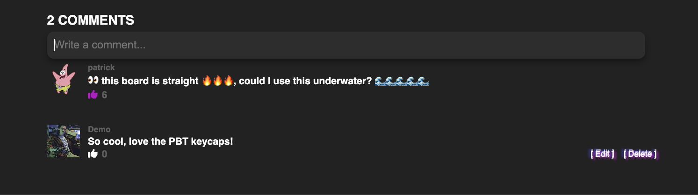
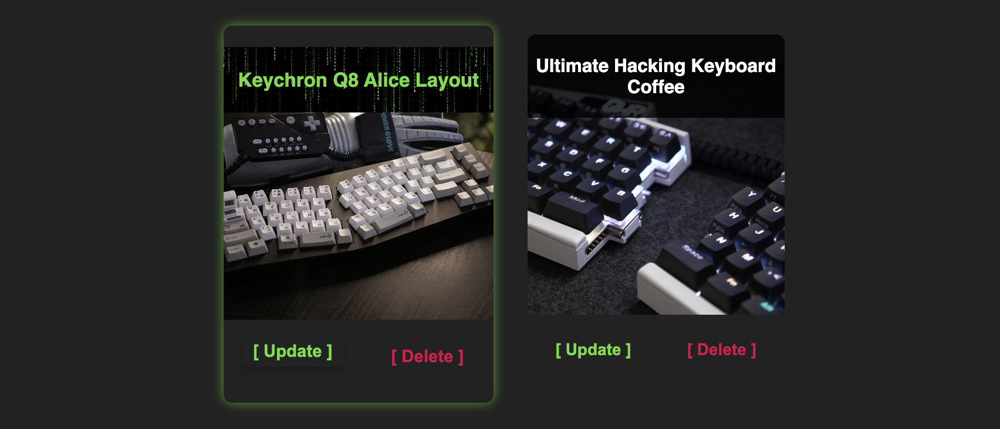

<h1 align="center" > ARE YOU SURE YOU WANT TO ENTER KEEBY?   

  <h3><a href="https://keeby.onrender.com">< [YES]</a>          [NO]</h3>

 </h1>

 
  

- Welcome to keeby, where you can list your mechanical keyboard for sale, engage with others in the comments, and browse the best mechanical keyboards on the market. This site is built using the latest technologies, including React, Redux, and Flask, to ensure a seamless user experience.
</h3>

- One of the key features of keeby is its integration with cloud storage, allowing you to store your keyboard images and descriptions securely and easily via AWS S3. This makes it simple for you to list your keyboards for auction and for buyers to browse them without any hassle.

- I designed this site in a retro aesthetic, which is designed to evoke the nostalgia of classic keyboard designs while maintaining a modern, sleek appearance. So come explore keeby, the innovative platform that brings together keyboard enthusiasts from around the world to buy and sell their favorite mechanical keyboards!

  

 
 

  

- The Home page serves as a hub for all available listings.

- Each listing card features a preview image and brief description.

- The layout is designed to make it easy for users to browse available listings quickly and efficiently.

- Clicking a listing card directs to the full listing details page.

 

  

  

- This page presents comprehensive information about a keeb.

- Each listing showcases all related images. 

- Every listing includes a dedicated comments section, enabling users to share their feedback and opinions.

- Users can like, edit, or delete comments.

 

 

The Manage Listings page provides users with an overview of all their listings and allows them to efficiently update or delete their listings as needed. This page incorporates a retro matrix hover effect and allows users to conveniently manage and maintain their listings with ease.

 

  

  

- The profile page showcases all user information.

- Allows users to modify individual details, without the need for a lengthy form.

- Features a unique retro computing aesthetic, complete with keyframed CSS scanlines and flicker effects.

  

<h2 align="center">Keeby Core <a href="https://github.com/StevenBradleyA/keeby/wiki/Feature-List">Features</a></h2>

- Full CRUD Listings
- Full CRUD Comments
- Full CRUD Users
- Partial CRD Comment Likes
- Search listing feature
- AWS S3 File storage

<h2 align="center">Future Implementation Goals</h2>

- Real-time bidding using Websockets
- Secure Payment Processing
- Reserve pricing
- Auction countdown
- Auction alerts
- Bid history

<!-- Links to socials linked in github etc -->
<h2 align="center">Connect with me </h2>

